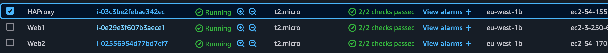

## Create a Vagrant Project Directory

Create a new project directory and navigate into it:

```bash
mkdir haproxy-loadbalancing-lab
cd haproxy-loadbalancing-lab
```
---

## **Initialize a Vagrant file for UTM**

Generate a Vagrantfile in project directory by running

```bash
vagrant init
```
The vagrant file defines the virtual machine default settings
---
## **Edit the vagrant file for UTM Compatibility**

To open the vagrantfile for editin:

```bash
nano Vagrantfile
```
Replace the contents with the following configuration to set up three VMs: `Web Server 1`, `Web Server 2`, and `HAProxy`.

```ruby
Vagrant.configure("2") do |config|
  # Use UTM provider for Vagrant
  config.vm.provider :qemu do |qemu|
      qemu.memory = 1024 # RAM in MB
      qemu.cpus = 1 # Number of CPU cores
  end


  # Web Server 1
  config.vm.define "web1" do |web1|
    web1.vm.box = "cloud-image/ubuntu-22.04"
    web1.vm.hostname = "web1"
    web1.vm.network "private_network", ip: "192.168.64.10"
    web1.vm.provision "shell", inline: <<-SHELL
      sudo apt-get update
      sudo apt-get install -y apache2
      echo "<h1>Welcome to Web Server 1</h1>" | sudo tee /var/www/html/index.html
      sudo systemctl enable apache2
      sudo systemctl start apache2
    SHELL
  end

  # Web Server 2
  config.vm.define "web2" do |web2|
    web2.vm.box = "cloud-image/ubuntu-22.04"
    web2.vm.hostname = "web2"
    web2.vm.network "private_network", ip: "192.168.64.11"
    web2.vm.provision "shell", inline: <<-SHELL
      sudo apt-get install -y apache2
      echo "<h1>Welcome to Web Server 2</h2>" | sudo tee /var/www/html/index.html
      sudo systemctl enable apache2
      sudo systemctl start apache2
    SHELL
  end

  # HAProxy Load Balancer
  config.vm.define "haproxy" do |haproxy|
    haproxy.vm.box = "cloud-image/ubuntu-22.04"
    haproxy.vm.hostname = "haproxy"
    haproxy.vm.network "private_network", ip: "192.168.64.12"
    haproxy.vm.provision "shell", inline: <<-SHELL
      sudo apt-get update
      sudo apt-get install -y haproxy
      sudo systemctl enable haproxy
      sudo systemctl start haproxy
    SHELL
  end
end
```
Save and exit.

---

## Edit the vagrantfile for UTM Compatibility

Edit the Vagrantfile to set up three VMs: Web Server 1, Web Server 2, and HAProxy. The following configurations were added:

- **Web Server 1:** IP: 192.168.64.10
- **Web Server 2:** IP: 192.186.64.11
- **HAProxy:** IP: 192.168.64.12

The Vagrantfile contents ensures a configuration for each VM to have it's own IP address and provisoin Apache for the web servers and HAProxy for load balancing.

---

## Download the Ubuntu box for UTM

To download the Ubuntu 22.04 box, i ran:

```bash
vagrant box add cloud-image/ubuntu-22.04 --provider=utm
```
- Finding a provider almost proved to be an issue for me as vagrant does not have alot of utm support. i had to look for a box which supported vagrant for me as it does not support my provider (utm).
- I ran the command `vagrant cloud search ubuntu-22.04` to look for a box compatible. there were alot of compatible boxes for virtual box, i did not see any for UTM. Although, i saw one which had a `QEMU` support, and this worked since UTM is based on qemu.

- In my Vagrant file i adjusted the provider from `utm` to `libvert` and settled at `qemu` which worked since that's the box available for qemu

replacing for this line in **Vagrantfile**
```bash
config.vm.provider :qemu do |qemu|
  qemu.memory = 1024 # RAM in MB
  qemu.cpus = 1 
```
i also installed the `vagrant-libvirt` plugin, and uninstalled the `vagrant-utm` plugin since we cant use it
---

## Start the VMs
Created and started the VMs by running:

```bash
vagrant up --provider=qemu
```
This command initialized all the three VMs based on the configurations in the Vagrantfile.

## Verify VMs are Running
Confirmed that all the VMs were running with"

```bash
vagrant status
```

- ## After trying with numerous means, i was not able to get a headway with vagrant on UTM mostly as a result of my system being out of date with most recent toos
- ## I Will go ahead and proceed with working with AWS so i can turn in the assinment, i'll resolve my issue with UTM/Vagrant some other time


## **Create EC2 INSTANCES (Web1, Web2, HAProxy)
### **In AWS Management Console go to:**
1 **EC2 Dashboard > Instances > Launch Instances.**
2 **Create 3 EC2 Instances:**
  - **AMI:*** Ubuntu 22.04 lTS 
  - **Instance Type:** t2.micro
  - **Network:** Default VPC
  - **Security Group:** Allow HTTP (80) AND ssh (22).

### ** Insance Naming and IP:**
- **Web1:** `192.168.0.10`
- **Web2:** `192.168.0.11`
- **HAProxy:** `192.168.0.12`



## SSH into EC2 Instances
To access the instances:

```bash
ssh -i my_key.pem ubuntu@<Instance-Public-IP>
```
executed the command for `Web`, `Web2`, and `HAProxy`.

---

## **Install APACHE on the Web Servers**

**Run on both Web1 and Web2:**

```bash
sudo apt update
sudo apt install apache2 -y
echo "<h1> Welcome to Web Server 1</h1> | sudo tee /var/www/html/index.html
sudo systemctl enable apache2
sudo systemctl start apache2
```

run the same command for the other WEB Server, ensuring to change the HTML content

---
 ## **Install HAProxy on HAProxy server**
### **SSH into HAProxy:**
```bash
ssh -i my-key.pem ubuntu@192.168.0.12
```
## Install HAProxy
I ran:
```bash
sudo apt update
sudo apt install haproxy -y
```

---

## **Configure HAProxy**
**Edit the HAProxy config file:**
```bash
sudo nano /etc/haproxy/haproxy.cfg
```
replaced the file with this content (more like made sure the original script contained these files)

```cfg
global
    log /dev/log local0
    log /dev/log local1 notice
    daemon

defaults
    log global
    option httplog
    timeout connect 5000ms
    timeout client 5000ms
    timeout client 5000ms

frontend http_front
    bind *:80
    default_backend web_servers

backend web_servers
    balance roundrobin
    server web1 192.168.0.10:80 check
    server web2 192.168.0.11:80 check
```

then i ran

```bash
sudo systemctl restart haproxy
```

### Moved HAProxy config into /configs

moved the HAProxy config to project folder by executing the command:

```bash
scp -i web1-key-pair.pem ubuntu@54.155.121.154:/etc/haproxy/haproxy.cfg configs/
```
